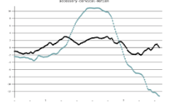
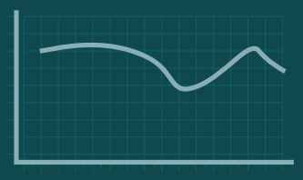
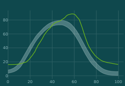
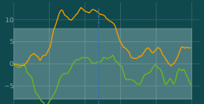
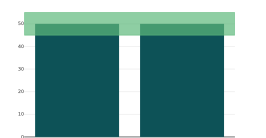
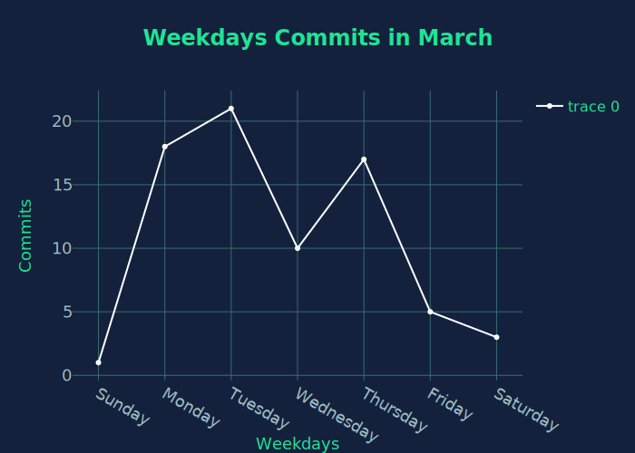

# Build PNG/SVG Images with Plotly Python

## What is Plotly
Plotly is a graphing library which provides multiple types charts and support multiple languages: Javascript, Python, R and so on.

## Story about why I choose Plotly
A project I was working on requested that line chart images. As we use python as our language, I have a couple of potential choices:
- seaborn(https://seaborn.pydata.org/index.html)
- pygal(http://pygal.org/en/stable/#)
- plotly(https://plot.ly/python/)

At the very beginning, all above libraries can meet our requirements, I chose `pygal` as the styles looks good enough for me and it is easy to draw the image and back to then we had two requirements only:
   - line chart
    - multiple lines on chart

The line chart we built in the very early stage:



Everything went well until one day I got a new requirement: 
   - the chart style need to be customized 

We need to make all products style consistency.





The first glance you can tell how crude the chart I built and I checked the pygal documentation and couldn't to find a way to customize background grid. We were not asked to build chart 100% like the design but at least 80% but I didn't have the pygal knowledge on customizing the charts we had. I tried seaborn which didn't make happen neither.

Then we found Plotly Python which has tons style customization options and we build our chart and we were happy about the result(I cut off the title, x and y axis labels as I don't want to expose specific information, believe the full version looks much better):




A couple of weeks later, we got more requirements:
  - draw a vertical line on the line chart
  - draw a horizontal range in certain area

Thanks for the shapes of plotly has `shape` which helps us draw the vertical line and the line can be solid/dashed/dotted and most recently we use `shape` draw polygons/triangle/rectangle on other charts.



Example of drawing shape on bar chart, amazing! right?



This is the journey I experience about charts, I am quit happy with plotly and high recommend it for people has similar requirements like I had.

## A fully running example:
Here's an example about line chart with title, labels. You can see that you can pretty much configure everything




Here I attach the source code that generate "Weekdays Commits in March":

```
import plotly.graph_objs as pgo
import plotly.io as pio

primary_color = '#14213d'
secondary_color = '#1fe494'

title_font = dict(color=secondary_color, size=24, )
axis_title_font = dict(color=secondary_color, size=18)


class LineChart:

    @staticmethod
    def build_chart(output):
        data = [1, 18, 21, 10, 17, 5, 3]
        days = ['Sunday', 'Monday', 'Tuesday', 'Wednesday', 'Thursday', 'Friday', 'Saturday']
        layout = LineChart.build_layout()
        fig = pgo.Figure(layout=layout)
        fig.add_trace(pgo.Scatter(
            x=days,
            y=data,
            line=dict(color='#ffffff',),
        ))

        pio.write_image(fig, output)

    @staticmethod
    def build_layout():
        title = '<b>' + 'Weekdays Commits in March' + '</b>'
        legend_settings = dict(traceorder='normal', font=dict(color=secondary_color, size=16))
        return pgo.Layout(
            paper_bgcolor=primary_color,
            plot_bgcolor=primary_color,
            title=dict(text=title, pad=dict(t=-5, l=-5, r=-5, ), font=title_font),
            showlegend=True,
            legend=legend_settings,
            xaxis=LineChart._axis('Weekdays', range=None),
            yaxis=LineChart._axis('Commits', range=None),
        )

    @staticmethod
    def _axis(axis_name, range):
        return dict(
            gridcolor='#366c70',
            zerolinecolor='#366c70',
            showgrid=True,
            zeroline=True,
            title=axis_name,
            titlefont=axis_title_font,
            color='#9ebfc3',
            tickfont=dict(size=18),
            range=range
        )


if __name__ == '__main__':
    LineChart.build_chart('/path/to/assets/line_chart.svg')
```

Happy coding!