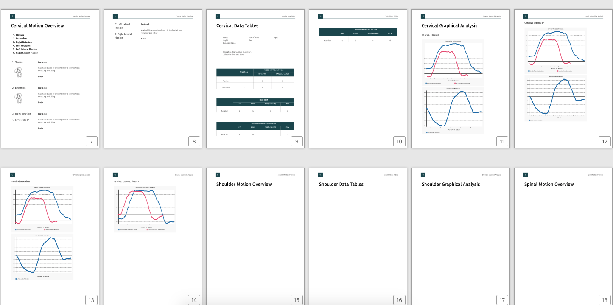

# Render WeasyPrint Ticket Sample on Web & PDF and Write to PDF (Part 1)

## What is WeasyPrint?
WeasyPrint is a python library which helps developers build beautiful PDF reports using HTML/CSS knowledge. You can
generate PDF file directly or render the PDF on web page using Flask. In this article I will show you how to use WeasyPrint
    
    - Render to Web Page
    - Render to PDF
    - Write to PDF

# My Story 
Several months ago I got a project which requires parsing data and writes analysed data into a PDF report. Back to then I have no experience on how to build PDF file, then I did research online and found a couple of potential popular technologies: jsPDF, ReportLab and pyPDF. As I have experience on multiple languages and also I can choose tech stack, it doesn't matter which certain technology to use but the report must be done in 3 months.


It took me about two weeks to experience those technologies. The data parsing consumes a lot of time and there are more than 20 graphs need to be generated and inserted into report, therefore I give up on jsPDF as it is a client side tool. 

One of the mockups I built:


I tried ReportLab and pyPDF2. Each of them has their own rules and it takes time to get used to and I wasn't satisfied with the result I had built.

I kept doing my research and finally found WeasyPrint and I was impressed on samples, what a beautiful PDF report! I read the documentation it says **WeasyPrint is a free rendering engine for HTML and CSS and you can export it to PDF and it supports the web standards** and then check its GitHub page and check it on StackOverflow which prove it is quite active, at that moment I knew it is what I want to use!

The project was confidential so I will not post the final version preview for now, maybe later when it is available on the market.

# Steps to render in Web page and PDF
## Installation
`pip install WeasyPrint` and `pip install Flask-WeasyPrint`

You can go check the installation details here https://weasyprint.readthedocs.io/en/latest/install.html

## Preview:

### Render as Web Page


### Render as PDF 


## _Render Web Page & PDF_
### Folder Structure
Make sure use the structure which can be recognized by Flask.
```
ticket
  |__web
       |__static
              |__styles
                     |__ticket.css  
       |__templates
              |__ticket.html
       |__flask_ticket.py
       |__README.md
```

### Setup Flask and enable debug mode:
Imports ticket.css, add below lines into ticket.html 
```
<head>
    <link rel=stylesheet href="{{ url_for('static', filename='styles/ticket.css') }}" />
</head>
```

**flask_ticket.py**
Two routes here, one is render to web page directly and another is render to pdf on webpage.
```
from os import path, walk
from flask import Flask, render_template, url_for
from flask_weasyprint import HTML, render_pdf

app = Flask(__name__)

# Display Web View
@app.route('/ticket/', defaults={'name': 'World'})
def ticket_html(name):
    return render_template('ticket.html', name=name)


# Generate PDF Version
@app.route('/ticket.pdf')
def ticket_pdf():
    # Make a PDF straight from HTML in a string.
    name =''
    html = render_template('ticket.html', name=name)
    return render_pdf(HTML(string=html))
```

I am not going to paste the ticket.html and ticket.css here, you can find them from [WeasyPrint Samples](https://weasyprint.org/samples/)

Tells Flask which app file to use and enables debug mode which helps debugging
```
export FLASK_APP=flask_ticket.py
export FLASK_DEBUG=1
# run below command in the same folder of flask_ticket.py
/path/to/bin/flask run
```

go `localhost:5000/ticket` will render to webpage and `localhost:5000/ticket.pdf` will render to PDF.

## _Write to PDF_
Make sure comment out `<link rel=stylesheet href="{{ url_for('static', filename='styles/ticket.css') }}" />`
when write to PDF file.

pdf_ticket.py
```
import os
import weasyprint
from jinja2 import Environment, FileSystemLoader

SRC_DIR = '/path/to/ticket/sandbox'
DEST_DIR = '/path/to/ticket/sandbox'
TEMPLATE = 'ticket.html'  # download from WeasyPrint sample
CSS = 'ticket.css'  # download from WeasyPrint sample
OUTPUT_FILENAME = 'test-ticket.pdf'

def start():
    env = Environment(loader=FileSystemLoader(SRC_DIR))

    template = env.get_template(TEMPLATE)
    css = os.path.join(SRC_DIR, CSS)
    
    # variables
    template_vars = { }

    # rendering to html string
    rendered_string = template.render(template_vars)
    html = weasyprint.HTML(string=rendered_string)
    report = os.path.join(DEST_DIR, OUTPUT_FILENAME)
    html.write_pdf(report, stylesheets=[css])
    print('file is generated...')


if __name__ == '__main__':
    start()
```

Run `python pdf_ticket.pdf` will generate a PDF file directly.

## My thought
Render HTML content as Web page really helps. It is just like web programming, you can use webtool debug on your CSS and layouts, it is easy to check the margins, paddings and other details, you don't need to tweak the layout pixel by pixel and generate PDF again and again, it saves tons of time!


Hope it helps, happy coding!