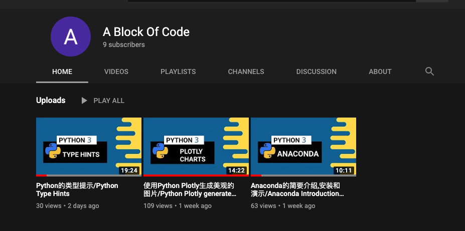

# My YouTube Channel.

I have created my YouTube Channel `A Block Of Code` two weeks ago. My purpose is to shared soem tips
I have learned in the last a couple of years.

The plan is to share how to become a Fullstack Developer which will cover topics about Python, Java,
Javascript/Typescript and some server configurations.

Currently I am sharing why I chose python and the topics would be

    - Anaconda
    - Plotly Charts
    - Type Hints
    - RESTFul API
    - Regular Expressions
    - Excel Spreadsheets

Hopefully this channel will help someone gets started about programming.